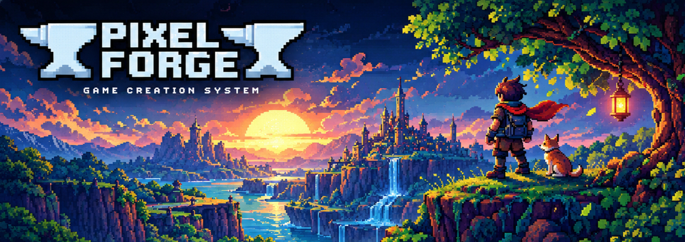

<div align="center">

# ✦ Pixel Forge

### A tiny retro game studio for making big worlds, pixel by pixel.

**[▶ Launch Pixel Forge in your browser](https://neshath.github.io/pixel-forge/)**

[](https://github.com/neshath/pixel-forge/actions/workflows/linux.yml)
[](https://github.com/neshath/pixel-forge)
[](https://github.com/neshath/pixel-forge)
[](LICENSE)


<br>

[](https://github.com/neshath/pixel-forge/stargazers)
[](https://github.com/neshath/pixel-forge/network/members)
[](https://github.com/neshath/pixel-forge/issues)
[](https://github.com/neshath/pixel-forge/commits)

</div>

Pixel Forge is a **local-first retro game creation studio** for making small 2D games without an account, hosted backend, or heavyweight editor workflow. Draw terrain, place entities, make sprites, and export to play anywhere.

The browser editor and native Linux desktop app share the same project model, renderer, runtime, and export path.

## Preview




> **Current status:** The first playable editor/runtime slice is complete. The Tauri desktop shell builds successfully for Linux, and the project is being prepared for real Omarchy/Hyprland validation and community review.

```js
const pixelForge = {
  mission: "Make something playable.",
  audience: "Curious game creators and pixel-art beginners",
  platforms: ["Browser", "Linux", "Omarchy", "Hyprland"],
  workflow: ["Draw", "Place", "Configure", "Playtest", "Export"],
  storage: "Local-first · portable .pixel.json projects",
  style: "Tactile 1990s workstation with original pixel motifs",
  currentFocus: "Omarchy package validation and community review",
  funFact: "Every visible tool is meant to do something."
};
```
